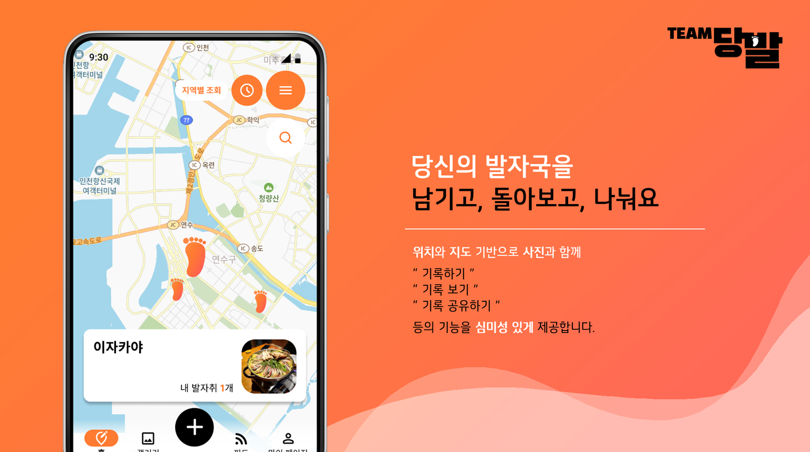
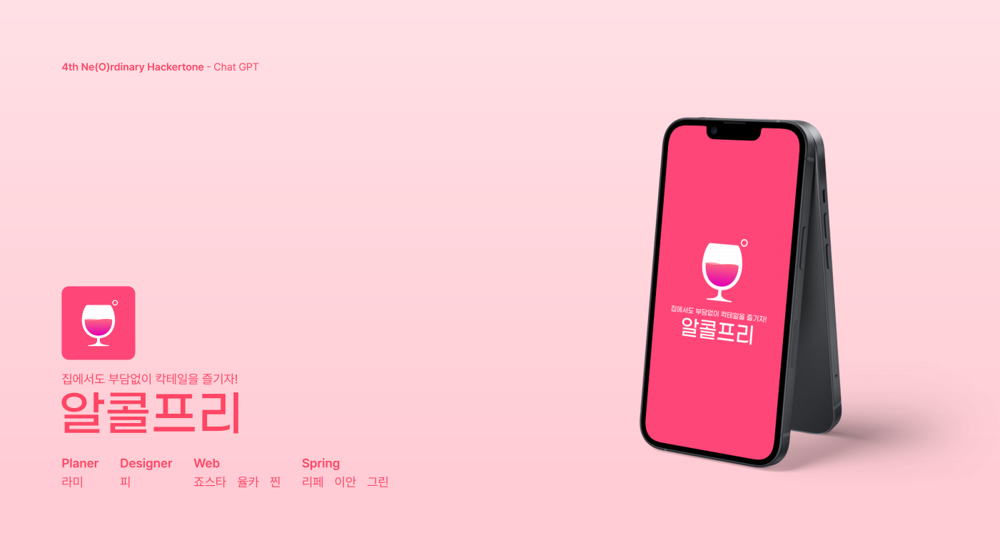
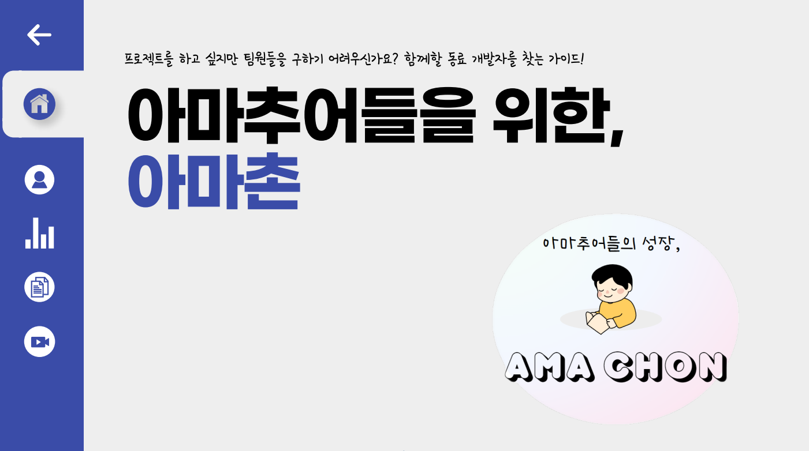

<h1 align="center">Hi there🖐️</h1>  

<h1 align="center">💪 Skills</h1>
 

 

<h1 align="center">👉 GitHub Status</h1>

<h1 align="center">🏃 Algorithm</h1>

 

<h1 align="center">Projects</h1>

 <b>지도에서 위치와 함께 의미 있는 사진을 편리하게 기록할 수 있는 서비스</b>   
🤚 역할 : Backend Developer  
🛠️ 사용한 기술 : Spring, JPA, MySQL, EC2, RDS, S3 
📃 Notion [https://mud-century-1f3.notion.site/6b9240d756bd4a56b4dbb6f71f41cb6c]   
👉 Github [https://github.com/UMC-Foot-Step] 
 

  

 <b>논알콜 칵테일 추천 & 레시피 설명 & Chat Gpt를 이용한 새로운 칵테일 레시피를 추천해주는 서비스</b>   
🤚 역할 : Backend Developer 
🛠️ 사용한 기술 : Spring, JPA, QueryDsl, GPT API, MySQL, EC2, RDS  
📃 Notion [https://grass-jasmine-f40.notion.site/f3b3e959d3354fe8a301d84c3860c398?pvs=4]  
👉 Github [https://github.com/Alcohol-Free-UMC-CMC/AlcoholFreeBack] 
  

  

 <b>아마추어를 위한 프로젝트 매칭 서비스</b>   
🤚 역할 : Backend Developer & Project Manager 
🛠️ 사용한 기술 : Spring, JPA, QueryDsl, MySQL, EC2, RDS, S3 
📃 Notion [https://best-jitterbug-a77.notion.site/8a1f98cbb7d944649b2f9aed11781247?pvs=4]   
👉 Github [https://github.com/Project-AmaChon/Server] 
 

  

